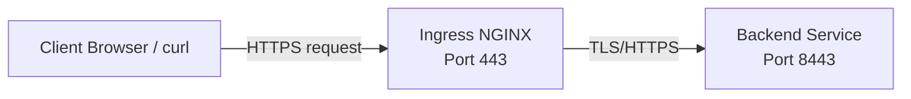

# 🚀 Kubernetes HTTPS Demo with Kind & Ingress-NGINX

This repository contains scripts and Kubernetes manifests to **fully bootstrap a devops task** with:

- A **Kind cluster** named `tronius`, ready for ingress traffic on ports 80/443
- An **NGINX Ingress controller** installed automatically (if not already present)
- **Self signed TLS certificates** generated locally:
  - CA certificate
  - Server certificate for `myservice.example.com`
- **Kubernetes secrets** created for the server and CA certificates
- A **demo backend service** running HTTPS on port `8443`
- An **Ingress** routing HTTPS traffic from `myservice.example.com` to the backend
- Automatic **waits** for kind cluster and ingress pods to be ready
- A **curl test** at the end to verify the service is reachable using the CA certificate

This setup provides a **fully secured HTTPS environment** for testing and development on your local machine.

---

## 📦 Requirements

- [kind](https://kind.sigs.k8s.io/) — Kubernetes in Docker
- [kubectl](https://kubernetes.io/docs/tasks/tools/) — Kubernetes CLI
- optional
  - [openssl](https://www.openssl.org/)

---

## ▶️ Usage

1. Clone the repository:

   ```bash
   git clone https://github.com/xpliz/tronius.git
   cd tronius
   ```

2. Generate certificates:

   ```bash
   ./generate-certs.sh
   ```

3. Bootstrap the Kind cluster and deploy everything:

   ```bash
   ./bootstrap.sh
   ```

---

## 🌐 Accessing the Service

1. Add the following line to your `/etc/hosts` file:

   ```bash
   127.0.0.1   myservice.example.com
   ```

2. Test the HTTPS endpoint:

   ```bash
   curl --cacert certs/ca/ca.crt.pem https://myservice.example.com/
   ```

3. You can skip adding host to /etc/hosts or equivalent by running:
  
    ```bash
    curl --cacert certs/ca/ca.crt.pem --resolve 'myservice.example.com:443:127.0.0.1' https://myservice.example.com
    ```

4. Verify certificate

   ```bash
   openssl s_client -CAfile certs/ca/ca.crt.pem -showcerts -connect localhost:443 -servername myservice.example.com </dev/null
   ```

### 🚀 You should see the demo HTML page served by the backend

### ⭐ For adding CA certificate to your OS, please refer to OS guide how to add self signed certificates

---

## 🗺 Architecture Diagram



- **Client** connects via HTTPS to the Ingress controller.  
- **Ingress** terminates TLS (using the server certificate) and forwards requests to the **backend service** over HTTPS.  

---

## 🛠 Rerunning the Script

- Reuses cluster if it exists  
- Secrets are recreated silently  
- NGINX ingress only installs once  

---

## 🧹 Cleanup

```bash
kind delete cluster --name tronius
```
