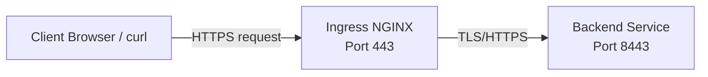

# 🚀 Kubernetes HTTPS demo with kind & ongress-nginx

This repository contains a bootstrap script and Kubernetes manifests to spin up a **local Kind cluster** with an **NGINX ingress controller** and a demo HTTPS backend service.  
Certificates are generated locally to enable TLS between the ingress and backend.  

---

## 📦 Requirements

- [Kind](https://kind.sigs.k8s.io/) — Kubernetes in Docker  
- [kubectl](https://kubernetes.io/docs/tasks/tools/) — Kubernetes CLI  
- Bash (Linux/Mac, or WSL on Windows)

---

## ▶️ Usage

1. Clone the repository:

   ```bash
   git clone https://github.com/youruser/yourrepo.git
   cd yourrepo
   ```

2. Generate certificates:

   ```bash
   ./generate-certs.sh
   ```

3. Bootstrap the Kind cluster and deploy everything:

   ```bash
   ./bootstrap.sh
   ```

---

## 🌐 Accessing the Service

1. Add the following line to your `/etc/hosts` file:

   ```
   127.0.0.1   myservice.example.com
   ```

2. Test the HTTPS endpoint:

   ```bash
   curl --cacert certs/ca/ca.crt.pem https://myservice.example.com/
   ```

You should see the demo HTML page served by the backend.  

### ⭐ For adding CA certificate to your OS, please refer to OS guide how to add self signed certificates.

---

## 🗺 Architecture Diagram



- **Client** connects via HTTPS to the Ingress controller.  
- **Ingress** terminates TLS (using the server certificate) and forwards requests to the **backend service** over HTTPS.  

---

## 🛠 Rerunning the Script

- Idempotent:  
  - Reuses cluster if it exists  
  - Secrets are recreated silently  
  - NGINX ingress only installs once  

---

## 🧹 Cleanup

```bash
kind delete cluster --name tronius
```
